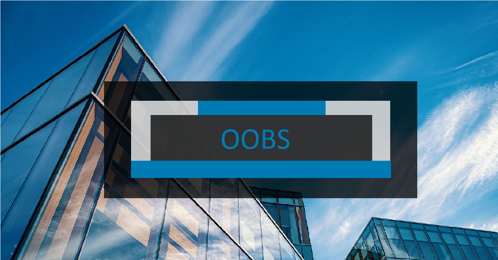

# **(OOBS)** -> Object Oriented Bank System.

🎫 Show details.

| Project details  |           |
| ------------     | --------- |
| Developer    :   | Kareem    |
| Prog lang    :   | C++       |
| Version      :   | v3.0.0    |
| Starting Date:   | 9th-4-2024|

***
 project cover, project logo">

*ENJOY READING ^_^*

## 💡 The Idea.
    Making C++ CLI Application simulate BMS (Bank Management System) with two Applications (Bank Application, ATM Application) with their functionalities. continue reading.

## 📝 Project notes.

1. **important note :** this project from my own creation not following any course or bootcamp.
2. **another one :** Every line of code, every image in this project is mine (my creation) ,not from any external source.
3. I didn't study how to do SDLC steps **yet**, but i will try make them by name meaning.

***

## ♻ Project Lifecycle.

> <small>Click to get Details.</small> 

1. ### 📜 [Project Requirements.](./doc/1-Requirments/requirments.md)
2. ### 🎨 [Project Design.](./doc/2-Design/design.md)
3. ### 🧰 [Project Implemintation.](./doc/3-Implemintation/implemintation.md)
4. ### 🧪 [Project Testing.](./doc/4-Testing/testing.md)
4. ### 🚀 [Project Deployment.](./doc/5-Deployment/deployment.md)

## 🔑 Requirments to run App.
1. windos OS.
2. g++ Comiler.
3. available Bash terminal.

## ▶ How to run.

1. clone this repo to your device.
2. make sure you are in main folder "OOBS-Object_Oriented_Bank_System".
3. open your terminal in this folder path.
4. use this command `cd build` to go to build folder.
5. use this command `run.sh` to run the file that compile app and run it.
6. once you do that you found "**main.exe**" file escute it.
7. Finally 🎉, it's work;
9. use this demo username and password to login `username: admin`, `password: 1234`
8. explore it by your self .

##
